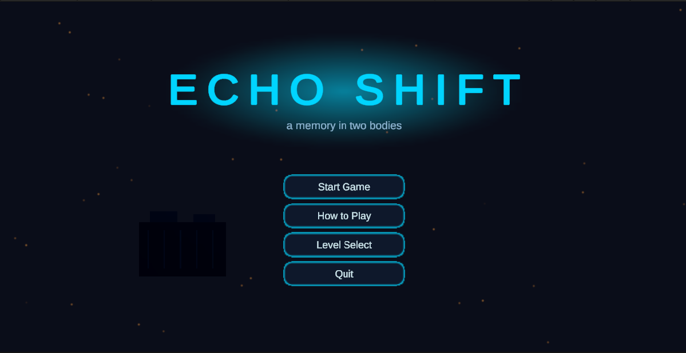

# Development Log

This folder is a session-by-session record of how **Echo Shift** was designed, built,
tested, and refined. It exists so that the *process* — not only the final build — can be
followed and assessed.

## How it works

- **One session = one working day.** Each session is its own file named
  `Session-NN_YYYY-MM-DD.md`.
- Every session records six things: the **plan**, **what changed** since last time, the
  **design/technical decisions** and how the thinking evolved, **problems and fixes**,
  **testing notes**, and the **plan for next session**.
- Each session links to the **commits / pull requests** made that day, so this written
  record and the Git history corroborate each other.
- High-level changes are also summarised in [`../CHANGELOG.md`](../CHANGELOG.md).
  Formal playtest rounds (someone sits down and plays a build) are written up in
  [`../PlayTestNotes/`](../PlayTestNotes/) and linked from the relevant session.

## Reading order

Start at Session 01 and read forward. The log is meant to show how the idea moved from
the [Game Concept Document](../../5.19-Echo%20Shift%20%E2%80%94%20Game%20Concept%20Document.md)
to a polished vertical slice.

## A note on the development model

The core game and four levels were built rapidly on Day 1 (2026-05-25) using a custom
one-click Unity editor pipeline that procedurally generates **all** art, audio, prefabs,
and scenes — so every asset is original and the whole project is reproducible from source.
From Day 1 onward this log documents the iterative phase: playtesting, balancing,
bug-fixing, and polish.

## Index

- [Session 01 — 2026-05-25](Session-01_2026-05-25.md) — Core echo mechanic, one-click
  builder, four levels + menu, complete game loop.
- _(add new sessions here as they are written)_

---

**To start a new session:** copy [`_TEMPLATE.md`](_TEMPLATE.md), rename it
`Session-NN_YYYY-MM-DD.md`, fill it in the same day, and add a line to the index above.
