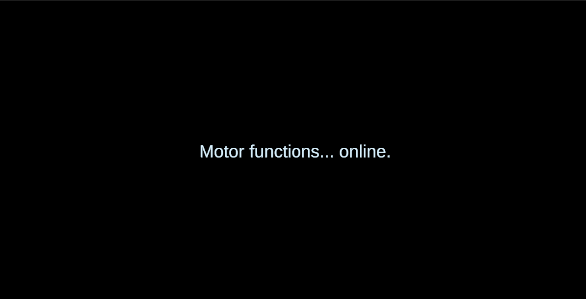
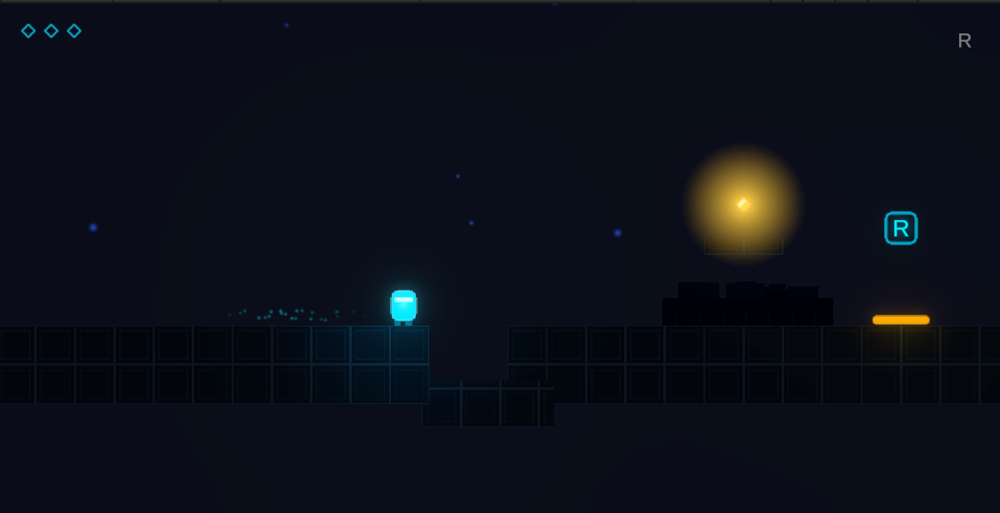
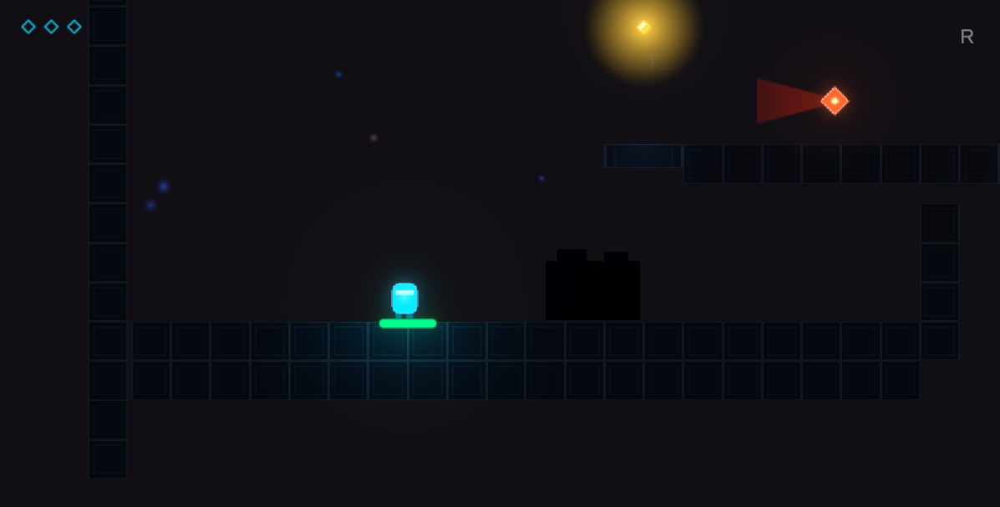

# Session 01 — 2026-05-25

**Duration:** ~6h (11:40–17:51)  **Version:** v0.1 → v0.3  **Commits / PRs:**
PR #1 `7c5cac0`, PR #2 `75a227a`, PR #3 `7e59dc8` (all merged to `main` the same day)

> This is the project's first build day, so there is no "previous session". The plan below is taken from the [Game Concept Document](../../5.19-Echo%20Shift%20%E2%80%94%20Game%20Concept%20Document.md) written on 2026-05-19.

## 1. Plan for this session

Stand up the whole vertical slice in one focused build day, in the order the Concept
Document prioritised:

- [x] Prove the core idea: hold **R** to record, release to spawn a clone that replays my
      motion and can hold a pressure plate to open a door (the MVP).
- [x] Wrap it in a complete game loop: main menu, HUD, pause, victory, audio, and a second level introducing an enemy / moving platform.
- [x] Add an intro level and a third level, a level-select screen, and progress that
      carries across levels.

## 2. What changed since last session

First day, so this is everything. Built in three milestones (one pull request each):

- **Added (PR #1 — MVP, `7c5cac0`):** `PlayerController` (run + jump, facing, grounded check, respawn), the echo system (`EchoRecorder` + `EchoClone` + `RecordedFrame`), `PressurePlate` + `Door`, and a **one-click editor pipeline** that generates all art, audio, prefabs, and scenes. Level_01 puzzle proven end to end.
- **Added (PR #2 — game loop, `75a227a`):** `MainMenu`, `HUDController`, `PauseMenu`, `VictoryScreen`; `AudioManager` + `SceneFader` + `AppBootstrap` (persistent app layer); `PatrolDrone` enemy, `MovingPlatform`, `Checkpoint` + respawn; Level_02.
- **Added (PR #3 — progression, `7e59dc8`):** Level_00 (intro) and Level_03; level-select screen (`LevelButton`); `GameProgress` save layer that tracks fragments, times, and completion across all levels.

## 3. Decisions & how my thinking changed

- **Decision:** Capture motion in `FixedUpdate`, not `Update`.
  **Why:** The Concept Document flagged "timing mismatch / replay drift" as the biggest risk. Recording on the fixed physics step makes playback deterministic and frame-rate independent. **Alternatives considered:** recording in `Update` with delta-time interpolation — rejected as more code for a drift problem I could avoid by design.
- **Decision:** The clone is a **kinematic `Rigidbody2D`** driven with `MovePosition`.
  **Why:** It must trigger pressure plates (so it needs a live collider and physics
  callbacks) but must *not* be pushed around by forces or gravity — it has to land exactly where I stood. Kinematic + `MovePosition` gives trigger events without simulation.
- **Decision:** Exactly **one** clone at a time; a new recording dissolves the old one.
  **Why:** Matches the "cut first" list in the Concept Document — multiple simultaneous clones explode puzzle and code complexity for little gain at this scope.
- **Decision:** Build the entire project from a **one-click procedural pipeline** (editor
  scripts draw every sprite pixel-by-pixel to PNG and synthesise every sound as 16-bit PCM WAV, then assemble prefabs and scenes).
  **Why:** Every asset is original (no licensing/attribution risk) and the whole game is
  reproducible from source.
  **Trade-off (honest):** building this fast in one day compresses the *visible* increment of progress. This DevLog and steady commits from here on are how I am addressing that — Day 1 is the rapid prototype; the following sessions are iterative polish and testing.

## 4. Problems hit & how I solved them

- **Clone did not activate the pressure plate at first.** Cause: a plain replay object has no physics body, so `OnTriggerStay2D` never fired on the plate. Fix: give the clone a kinematic `Rigidbody2D` and move it with `MovePosition` (see decision above).

- **Menu and HUD buttons were dead.** Cause: the canvases are built in code and I never added an `EventSystem`, so Unity's UI received no input events. Fix: the builders now guarantee exactly one `EventSystem` per scene. (PR #2)
- **The rising platform crushed the player.** Cause: in Level 3 areas 1 & 2 the
  plate-raised platform rose into the walkway directly above it, pinning me against the ceiling. Fix: offset the walkways to the side so the platform stops flush with the ledge. (PR #3)
- **Re-running the builder duplicated everything.** Cause: the generator added a second copy instead of replacing the first. Fix: made the build idempotent — it clears the previous output and rebuilds cleanly. (PR #1)

## 5. Testing this session

After each milestone I self-playtested the whole flow and fixed what broke the same day.
The findings and the changes they caused are written up in [Playtest 01](../PlayTestNotes/Playtest-01_2026-05-25.md); the highlights are below. A second round with a fresh player is planned for Session 02.

| What I tested | How | Result / observation | Change made |
| ------------- | --- | -------------------- | ----------- |
| Core loop: record → clone holds plate → door opens → run through | Self-play, Level_01 | Works | — |
| All four levels load from the menu and can be completed | Self-play, L0–L3 | Works | — |
| **Can the decoy be skipped?** Pass the drones in L2 Area 2 / L3 Area 3 *without* recording a clone | Self-play | At first the gap was loose enough to just run past, defeating the mechanic | Tightened patrol distance/speed + added a safe record buffer so the decoy is actually required (PR #3) |
| Rising platform, L3 areas 1 & 2 | Ride it up while the clone holds the plate | Crushed against the walkway above | Offset walkways; platform stops flush (PR #3) |
| Optional fragment reachability | Try to jump to each off-path fragment | Some ledges sat above the jump apex (~2.8 units, from `jumpForce 15`) | Lowered the optional ledges into jump range (PR #3) |
| **Softlock check:** does any drone patrol overlap a required plate or the only path? | Review + play, L2 Area 4 | Confirmed OK — no softlock; the upper drone clears the plate at x88 and the bridge drone never blocks the only route (a hit just respawns at the area checkpoint) | — |
| **Timed run, L2 Area 3:** is the 5s clone long enough to sprint plate→door past the drone? | Self-play | Confirmed OK — 5s is enough to reach the door past the patrol | — |

## 6. Next session plan

**Session 2 focus (chosen):** real enemy detection + chase AI, and a first polish pass.
"Ride your echo" and new puzzle devices are deferred to Session 3+.

### A. Make the patrol drone actually *see* (AI)

- [ ] Turn the detection cone into a real sense: a line-of-sight check (raycast within the
      cone angle, blocked by the `Ground` layer) against both the player and the echo clone.
- [ ] Add a state machine — **Patrol → Alert → Chase → Search → back to Patrol** — with chase
      a little slower than the player's `moveSpeed 7.5`, so cover and decoys matter and you can
      still escape.
- [ ] Drive the cone colour from the real state (normal / alert), not just from being stunned.
- [ ] *Test:* enter the cone → it chases; break line of sight behind a wall → it loses you and
      searches, then returns; record an echo as bait → it chases the echo while you slip past.
- [ ] *Re-test (important):* the new AI changes enemy behaviour, so re-verify the L2/L3 decoy
      corridors are still solvable and that **chasing can never push the player into a softlock
      or off the level** — this supersedes the Session 1 "softlock OK" check.

### B. First polish pass (font + game feel)

> **Correction (added during Session 2 review):** this list overstated the work — several
> "juice" items were *already implemented in Session 1*: the **echo trail** (TrailRenderer on
> the Echo prefab), **landing dust** (`PlayerAnimator.OnLanded`), and the **hard-landing camera
> shake** (`CameraShake` auto-subscribes to `Landed`). The genuinely-new Section B items are:
> an OFL font, a pressure-plate press particle, a death camera shake, a death hit-stop, and
> richer (still 100% procedural) audio.

- [ ] Replace the default font with a free **OFL** font (clean / sci-fi); apply it to the
      title, HUD and narrative; add it to Credits and update the README font line.
- [ ] Add the *genuinely-new* juice only: a pressure-plate press particle, a death camera shake,
      and a brief hit-stop on death. *(Echo trail, landing dust, and hard-landing shake already
      shipped in Session 1 — see the correction above.)*
- [ ] Thicken the **procedural** audio (layered transients + envelopes, slight pitch variation,
      a BGM pad) — kept fully original, no external SFX.
- [ ] *Test:* font is crisp with no overflow at menu / HUD / in-world; framerate holds; audio
      does not clip; a fresh player notices the feedback.

**Asset decision:** add one free **OFL** font (credited); all audio stays procedural and
original but made richer. Update the README's "original assets" wording to note the single
licensed font.

### Already done (carry-over from Session 1)

- [x] Run a **structured playtest with a fresh player** (not me) across L0–L3 and log it in [`../PlayTestNotes/`](../PlayTestNotes/).
- [x] Confirm no required step or wall can be skipped or is too tall to clear (jump apex
      ~2.8 units) — e.g. that `BlockWallA` (height 3) still forces the platform route.
- [x] From the playtest, pick the top 2–3 issues (difficulty, pacing, clarity of the record
      mechanic) and fix them.
- [x] Start the `README.md` (game summary, controls, how to run, credits).

## 7. Screenshots / evidence

End-of-day build state, in play order (menu → intro → record tutorial → first enemy):

*Main menu — procedurally drawn title glow, drifting starfield, and the four options
(Start / How to Play / Level Select / Quit).*

*Level 0 "Awakening" — the opening lines fade in on black before control is handed to the player.*

*Level 1 — the world-space **R** prompt teaches the record-and-replay mechanic at the first pressure-plate puzzle.*

*Level 3 "The Core" — a patrol drone and its detection cone; the echo clone is recorded as a decoy to slip past.*
