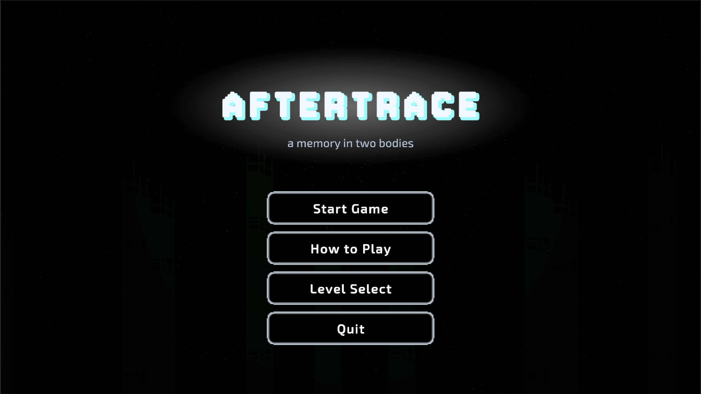
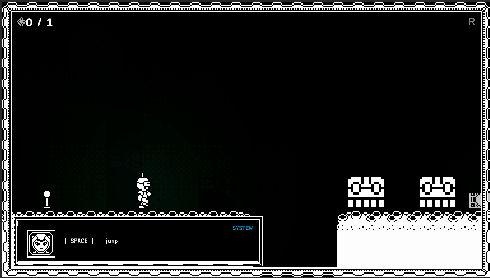
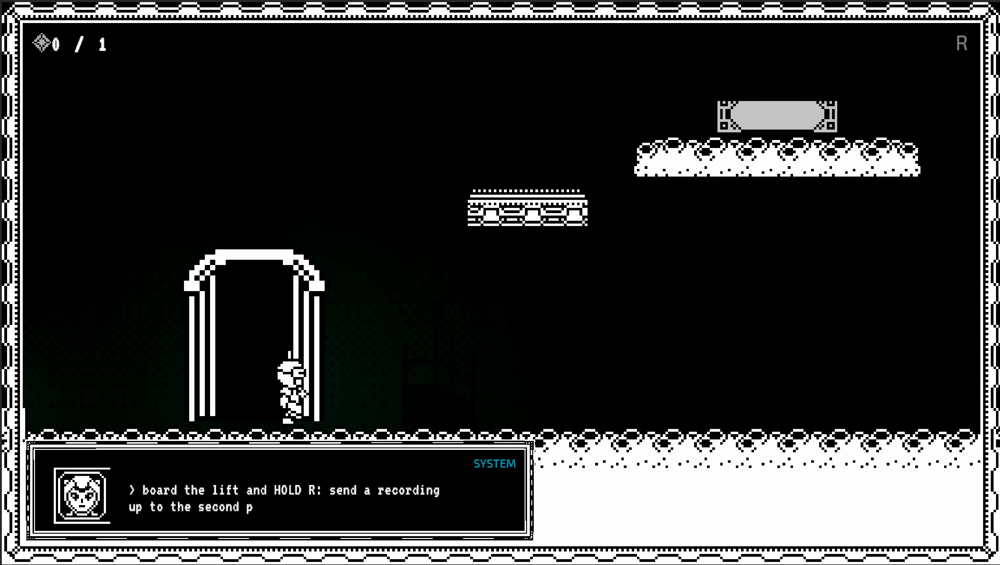
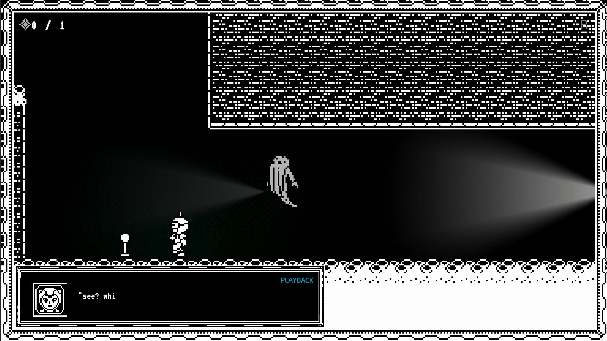

<h1 align="center">Aftertrace</h1>

<em>Record your own movements, replay them as a ghost clone, and cooperate with your past self.</em>

  
  
  
  

  

A 2D puzzle-platformer where you **record up to five seconds of your own movement and replay
it as a glowing echo** — solving puzzles that need two bodies: hold a pressure plate, stand
on your echo's head to clear a wall, replay a crate push, or bait a searchlight drone into
chasing your decoy. Three hand-authored levels, four illustrated story acts, a strict
**1-Bit + cyan** look, and a real ending — about **5–10 minutes** of play. Coursework for the
Games Programming module (University of Dundee).

<table>
  <tr>
    <td align="center"> Level 0 — Awakening</td>
    <td align="center"> Level 1 — Playroom</td>
    <td align="center"> Level 2 — Hide and Seek</td>
  </tr>
</table>

## Play it

- **Just play it (no Unity needed):** download the build, unzip it, and run **`Aftertrace.exe`** —
  keep the whole unzipped folder together.
- **Open the project / read the details:** see **[Aftertrace_01/README.md](Aftertrace_01/README.md)**
  for controls, the scene list, the full screenshot gallery, and the one art-kit restore step.

## Documentation index

Everything an assessor needs is in version-controlled Markdown, organised by purpose:

| Document | What it covers |
| --- | --- |
| **[Docs/DESIGN.md](Docs/DESIGN.md)** | Game concept & design — title, idea, intended experience, core mechanic, moment-to-moment, target player, references, originality, vertical slice, MoSCoW & cuts, Unity plan, systems/scripts, asset plan, legal/ethical/accessibility/security, schedule |
| **[Docs/PROJECT_REPORT.md](Docs/PROJECT_REPORT.md)** | Post-project report — design choices, technical decisions, problems & limitations, testing and what changed, concept→final reflection, personal contribution, use of assets/AI, professionalism, known limitations |
| **[Docs/DECLARATIONS.md](Docs/DECLARATIONS.md)** | Field-by-field external-resource & AI-assistance declarations, in the module's requested format |
| **[Aftertrace_01/CREDITS.md](Aftertrace_01/CREDITS.md)** | Credits and per-asset licences (with sources and download dates) |
| **[Docs/PLAN.md](Docs/PLAN.md)** | Week-by-week plan, outcomes, carry-overs and cuts |
| **[Docs/CHANGELOG.md](Docs/CHANGELOG.md)** | Version history v0.1 → v1.1.x, each release mapped to its pull requests |
| **[Docs/DevLog/](Docs/DevLog/)** | Eleven session logs — one-day prototype → ship → documentation rebuild |
| **[Docs/PlayTestNotes/](Docs/PlayTestNotes/)** | Six playtest rounds (self and peer), each tied to the changes it caused |
| **[Docs/Game_View_Picture/](Docs/Game_View_Picture/)** | Screenshots from the current build |

## Repository layout

- **`Aftertrace_01/`** — the Unity game (the main project).
- **`Docs/`** — design, plan, report, declarations, dev log, playtest notes, screenshots.
- **`2D_Game_Improvements/`** — a separate in-class 2D-game improvement activity (not part of Aftertrace).

## Licence

MIT (see [`LICENSE`](LICENSE)) — covers the project's **original code and content only**.
Third-party assets keep their own licences; the CraftPix art kit's source PNGs are not
redistributed in this public repository (restore steps are in the
[game README](Aftertrace_01/README.md)). Full per-asset details in
[`CREDITS.md`](Aftertrace_01/CREDITS.md).
